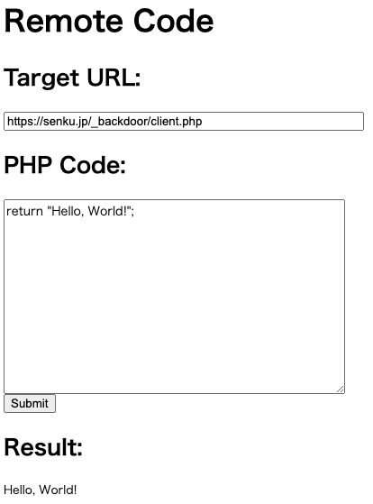

# php-openssl-encrypt
Hidden commands using OpenSSL

POST内容を秘密鍵、公開鍵を使用して暗号、複合化して通信を行う。

SSLに対応していないサイトであったり、WAFによる監視を回避するために使用。

また、複合化できない場合は処理を中断することで認証としても使用可能。


server.phpでのスクリーンショット



```sh
$ php key-gen.php
```
を実行して生成された鍵をserver.phpと、client.phpの変数に書き換えて使用してください。